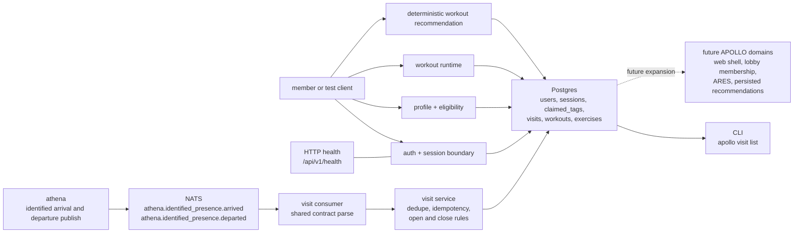

# apollo

APOLLO is the member-facing application in ASHTON. It will eventually own
profile state, privacy and availability controls, workout logging,
recommendations, and the ARES matchmaking subsystem.

> Current real slice: first-party member auth and session-backed profile state,
> deterministic visit-history ingest and close behavior, and derived lobby
> eligibility from persisted `visibility_mode` / `availability_mode`, plus the
> first explicit member-owned workout runtime and first deterministic workout
> recommendation read. APOLLO now proves account ownership, signed session
> handling, the first full visit lifecycle slice, the first real
> intent-behavior slice, explicit workout-history create/update/finish
> behavior, and a narrow coaching recommendation runtime without widening into
> AI planning or matchmaking.

This repo is now executable, but still intentionally narrow. The right way to
document it is to separate what is already real from what is only authored in
schema form or preserved as a future plan. Tracer 7 completes the first
deterministic recommendation slice on top of the Tracer 6 workout runtime:
members explicitly create, update, finish, and read workout history, then read
one member-scoped coaching recommendation without visit events implying
exercise activity or social intent.

## Start Here

| Reader | Start With | Why |
| --- | --- | --- |
| Recruiter or interviewer | [`Runtime Surfaces`](#runtime-surfaces), [`Current State Block`](#current-state-block), [`Why APOLLO Matters`](#why-apollo-matters) | These sections show the real backend slice quickly |
| Engineer | [`Architecture`](#architecture), [`Ownership And Boundaries`](#ownership-and-boundaries), [`Known Caveats`](#known-caveats) | These sections explain what APOLLO owns and where the product is still incomplete |
| Maintainer | [`docs/README.md`](docs/README.md), [`docs/glossary.md`](docs/glossary.md), [`docs/runbooks/member-state.md`](docs/runbooks/member-state.md) | These docs explain the current line, vocabulary, and member-state rules |

## Architecture

The standalone Mermaid source for this flow lives at
[`docs/diagrams/apollo-visit-ingest.mmd`](docs/diagrams/apollo-visit-ingest.mmd).

## Runtime Surfaces

| Surface | Path / Command | Status | Notes |
| --- | --- | --- | --- |
| HTTP health | `GET /api/v1/health` | Real | Indicates service health and whether the NATS consumer is enabled |
| Serve command | `apollo serve` | Real | Starts the health endpoint and optional NATS consumer |
| Verification start | `POST /api/v1/auth/verification/start` | Real | Starts registration or passwordless sign-in with student ID + email |
| Verification consume | `GET/POST /api/v1/auth/verify` | Real | Consumes a stored token, marks it used, verifies email ownership, and issues a signed session cookie |
| Profile read | `GET /api/v1/profile` | Real | Requires a valid session cookie and returns persisted member profile state |
| Profile update | `PATCH /api/v1/profile` | Real | Requires a valid session cookie and updates `visibility_mode` and `availability_mode` only |
| Lobby eligibility read | `GET /api/v1/lobby/eligibility` | Real | Requires a valid session cookie and derives open-lobby eligibility from stored profile state only |
| Workout create | `POST /api/v1/workouts` | Real | Requires a valid session cookie and creates one member-owned `in_progress` workout |
| Workout list | `GET /api/v1/workouts` | Real | Requires a valid session cookie and returns workout history ordered by newest creation first (`started_at DESC, id DESC`) |
| Workout detail | `GET /api/v1/workouts/{id}` | Real | Requires a valid session cookie and is owner-scoped |
| Workout update | `PUT /api/v1/workouts/{id}` | Real | Requires a valid session cookie and replaces draft exercise data while the workout is `in_progress` |
| Workout finish | `POST /api/v1/workouts/{id}/finish` | Real | Requires a valid session cookie and finishes a non-empty `in_progress` workout |
| Workout recommendation | `GET /api/v1/recommendations/workout` | Real | Requires a valid session cookie and returns one deterministic coaching recommendation from explicit workout history |
| Logout | `POST /api/v1/auth/logout` | Real | Revokes the current server-side session and clears the cookie |
| Visit readback | `apollo visit list --student-id ... --format text|json` | Real | Lists visit history for a member |
| Event consumer | `apollo serve` with `APOLLO_NATS_URL` | Real | Consumes `athena.identified_presence.arrived` and `athena.identified_presence.departed` from NATS |
| Recommendation storage | `apollo.recommendations` | Schema authored | Tracer 7 does not persist recommendation reads yet |
| Matchmaking runtime | - | Planned | ARES tables exist, service logic does not |

## Ownership And Boundaries

| APOLLO Owns | APOLLO Does Not Own |
| --- | --- |
| member profile and preference state | raw facility presence truth |
| derived lobby eligibility from explicit member intent | open lobby membership, invites, or match formation |
| visit history as member-facing context | occupancy counting |
| workout history | staff operations workflows |
| deterministic recommendation and coaching context | the shared wire contract definitions |
| explicit matchmaking intent and ARES | tool routing and global approval policy |

APOLLO owns member intent. That is the key boundary. Presence can affect member
context, but tap-in alone must not create workout logs, matchmaking lobby
eligibility, or any social state.

## Current Data Model

| Area | Status | Current Runtime Use |
| --- | --- | --- |
| `apollo.users` | Real | Member records now support visit linkage, email verification state, and flexible profile preferences |
| `apollo.email_verification_tokens` | Real | Stores hashed verification tokens with expiry and single-use semantics |
| `apollo.sessions` | Real | Stores server-side session state keyed by a signed cookie value |
| `apollo.claimed_tags` | Real | Links ATHENA identity hashes to member accounts |
| `apollo.visits` | Real | Stores visit open/close history with deterministic departure idempotency |
| `apollo.workouts` and `apollo.exercises` | Real | Stores explicit workout draft and finished history with ordered exercise rows |
| `apollo.ares_*` tables | Schema authored | Matchmaking and skill logic are deferred |
| `apollo.recommendations` | Schema authored | Tracer 7 recommendation reads are derived at read time; persisted recommendation records remain deferred |
| `users.preferences` JSONB | Real schema, future-heavy use | Intended home for flexible member-intent state such as `visibility_mode` and `availability_mode` |

## Technology Stack

| Layer | Technology | Status | Line | Notes |
| --- | --- | --- | --- | --- |
| Service runtime | Go 1.23 | Instituted | `v0.0.x` -> `v0.6.0` | The current executable slice is a Go service |
| HTTP router | chi | Instituted | `v0.1.x` -> `v0.6.0` | Current API surface is intentionally narrow and tracer-driven |
| CLI | Cobra | Instituted | `v0.2.x` -> `v0.6.0` | `serve` and `visit list` are real |
| Database driver | pgx | Instituted | `v0.0.x` -> `v0.6.0` | Used for runtime persistence |
| SQL generation | sqlc | Instituted | `v0.1.x` -> `v0.6.0` | Auth, session, profile, and visit queries are generated from checked-in SQL |
| Eventing | NATS | Instituted | `v0.2.x` -> `v0.6.0` | Consumes ATHENA identified arrival and departure events |
| Shared contract | `ashton-proto` generated packages + runtime helper | Instituted | `v0.2.x` -> `v0.6.0` | APOLLO no longer owns a private copy of the event wire format |
| Auth path | first-party student ID + email verification + signed session cookie | Real | `v0.1.x` | Tokens are stored hashed in Postgres and sessions are server-side rows referenced by a signed cookie |
| Workout runtime | relational workout model | Real | `v0.5.0` | Authenticated create, update, finish, read, and list behavior is active |
| Recommendation runtime | deterministic derived read over workouts | Real | `v0.6.0` | Authenticated `GET /api/v1/recommendations/workout` is active without persisting outputs |
| Minimal member web shell | SvelteKit over existing APIs | Planned | `v0.7.0` | Tracer 11 should stay on top of already-real APIs |
| Lobby membership runtime | explicit member-scoped membership state | Planned | `v0.8.0` | Tracer 12 should stay separate from eligibility and visits |
| ARES rating engine | OpenSkill | Planned | `v0.9.0` | Schema groundwork exists, service layer does not yet |
| Recommendation persistence | persisted recommendation records | Planned | `v0.10.0` | Persist outputs only after the deterministic read line is stable |
| Recommendation pipeline | LangGraph + vLLM + Mem0 | Deferred | `v0.11.0` | Preserved as future direction, not current runtime truth |
| Frontend widening | SvelteKit PWA + offline sync | Deferred | later than `v0.7.0` | Not yet present in the repo |

## Current Ingest Path

| Step | Current Behavior |
| --- | --- |
| ATHENA publishes lifecycle events | Subjects are `athena.identified_presence.arrived` and `athena.identified_presence.departed` |
| APOLLO inspects for the narrow anonymous no-op | Anonymous misroutes are ignored before strict parsing |
| APOLLO parses the payload | The shared `ashton-proto` helper validates source, type, enums, and timestamps |
| APOLLO resolves member identity | `claimed_tags` maps the ATHENA identity hash to an active user |
| APOLLO enforces idempotency | Duplicate arrival ids, duplicate departure ids, and already-open visits resolve deterministically |
| APOLLO records the lifecycle | Arrivals open visits, departures close matching open visits for the same member and facility |

This flow is intentionally narrower than the future product shape. It proves the
boundary from physical truth to member history first, then layers explicit
member-owned auth, intent, and workout runtime without letting visits imply
exercise, recommendations, or matchmaking.

## Known Caveats

| Area | Current caveat | Why it matters |
| --- | --- | --- |
| Verification delivery | The default runtime is still dev-first; verification is easy to test locally but not yet a full production-grade delivery path | APOLLO proves ownership and sessions, but not yet a polished end-user delivery experience |
| Claimed tags | `apollo.claimed_tags` is real schema and runtime dependency, but there is still no end-user flow to manage tag linkage | Visit ingest is narrower than the eventual member-account model |
| Product shell | The current line is backend-only in practice | The member-facing web surface is planned, not shipped |
| ARES and recommendation persistence | Schema groundwork exists, but runtime scope is still deterministic read logic only | Readers should not mistake authored tables for active matchmaking or persisted coaching |

## Current State Block

### Already real in this repo

- `apollo serve` starts a real Go process with health reporting
- APOLLO can start a member verification flow from student ID + email
- verification tokens are generated, stored hashed, expired, invalidated after use, and can be surfaced in local development through explicit token logging
- successful verification marks the user email as verified and issues a signed `HTTPOnly`, `Secure`, `SameSite=Strict` session cookie
- authenticated profile reads and writes are real for `visibility_mode` and `availability_mode`
- authenticated `GET /api/v1/lobby/eligibility` is real and derives
  `eligible`, `reason`, `visibility_mode`, and `availability_mode` from stored
  member state only
- authenticated `POST/GET/PUT /api/v1/workouts` and
  `POST /api/v1/workouts/{id}/finish` are real and keep workout state
  member-owned, explicit, and owner-scoped
- workout history lists newest created workouts first using DB-owned
  `started_at DESC, id DESC` ordering instead of mixed app-clock and DB-clock
  timestamps
- authenticated `GET /api/v1/recommendations/workout` is real and uses explicit
  precedence: `resume_in_progress_workout`, `start_first_workout`,
  `recovery_day` for workouts finished inside `24h`, then
  `repeat_last_finished_workout`
- recommendation reads are deterministic, member-scoped, and side-effect free:
  they do not create, update, or finish workouts and they do not mutate visits,
  profile state, claimed tags, or eligibility state
- only one `in_progress` workout is allowed per member at a time
- finished workouts are immutable through the current runtime surface
- logout revokes the current server-side session and clears the cookie
- APOLLO can consume `athena.identified_presence.arrived` and
  `athena.identified_presence.departed` from NATS
- the consumer uses the shared `ashton-proto` helper instead of a private event
  struct
- malformed payloads, wrong source values, wrong types, bad enums, and invalid
  timestamps are rejected clearly
- duplicate arrivals, duplicate departures, unknown tags, anonymous events,
  already-open visits, no-open departures, and out-of-order departures all
  resolve deterministically
- `apollo visit list` reads back recorded visit history for a specific student
- the bounded live cluster deployment now proves APOLLO can boot its schema,
  connect to in-cluster NATS, and persist the live ATHENA identified-arrival
  path into Postgres

### Real but intentionally narrow

- the active member-facing write surface is limited to auth, profile settings,
  and explicit workout history
- open-lobby eligibility is derived read-only state, not a join or leave flow
- visit recording and visit closing remain separate from auth and profile state
- the live cluster proof is still only the visit-ingest boundary; it does not
  widen APOLLO into a broader product deployment
- deterministic recommendation reads are now in the active tracer scope
- recommendation persistence, generated plans, and matchmaking are still
  outside the active tracer scope

### Authored in schema, not yet active in runtime

- ARES rating and match tables
- persisted recommendation storage

### Deferred on purpose

- The planned release lines below are the authoritative widening path. These
  bullets are only the short boundary reminders.

- tying visit creation or visit closing to workout logging
- auto-starting a workout from arrival or auto-finishing a workout from
  departure
- inferring recommendations from visits, departures, or physical presence
- storing recommendation reads or expanding into generated plans before the
  deterministic read path is stable
- letting tap-in imply lobby or matchmaking intent
- adding lobby membership persistence, invites, or match formation before the
  eligibility boundary is proven
- adding a frontend before the profile/auth boundary is real
- adding the recommendation pipeline before workout data exists

## Release History

| Release line | Exact tags | Status | What became real | What stayed deferred |
| --- | --- | --- | --- | --- |
| `v0.0.x` | `v0.0.1` | Shipped | bootstrap baseline, first schema and service shape | auth, eligibility, workouts, and recommendations |
| `v0.1.x` | `v0.1.0`, `v0.1.1` | Shipped | auth and profile foundation line | explicit lobby, workouts, and recommendations |
| `v0.2.x` | `v0.2.0`, `v0.2.1` | Shipped | eligibility plus visit-ingest line | visit close, workouts, and recommendations |
| `v0.4.x` | `v0.4.0`, `v0.4.1` | Shipped | visit close plus bounded live deploy deepening | workout runtime, broader product deploy, and recommendations |
| `v0.5.0` | `v0.5.0` | Shipped | explicit workout runtime | recommendation persistence, generated planning, and matchmaking |
| `v0.6.0` | `v0.6.0` | Shipped | deterministic recommendation runtime | web shell, lobby membership, ARES, and generated planning |

## Planned Release Lines

| Planned tag | Intended purpose | Restrictions | What it should not do yet |
| --- | --- | --- | --- |
| `v0.6.1` | optional Milestone 1.6 companion line if APOLLO repo truth changes materially | keep the repo change bounded to live departure-close support or deployment-truth alignment only | do not widen into broader product deployment |
| `v0.7.0` | minimal member web shell for Tracer 11 | stay on top of already-real auth, profile, workout, and recommendation APIs | do not widen into offline sync, generated plans, or matchmaking UI |
| `v0.8.0` | explicit lobby membership runtime for Tracer 12 | keep membership separate from eligibility and visits | do not imply invites, notifications, or auto-entry from tap-in |
| `v0.9.0` | first deterministic ARES match preview for Tracer 13 | operate only over explicit lobby members | do not widen into messaging, invites, or autonomous match flows |
| `v0.10.0` | recommendation persistence | persist recommendation outputs only after the deterministic read line is stable | do not mix persistence with generated coaching |
| `v0.11.0` | generated planning and coaching runtime | build on stable workout and recommendation foundations | do not let visits, departures, or profile state silently drive coaching logic |

## Project Structure

| Path | Purpose |
| --- | --- |
| `cmd/apollo/` | CLI entrypoint and serve command |
| `internal/auth/` | verification token lifecycle, server-side sessions, and signed cookie handling |
| `internal/eligibility/` | derived open-lobby eligibility from authenticated member state |
| `internal/consumer/` | NATS consumer and strict event parsing |
| `internal/profile/` | authenticated profile state read and update over `users.preferences` |
| `internal/visits/` | visit service and repository boundary |
| `internal/workouts/` | workout repository and service for explicit member-owned workout history |
| `internal/recommendations/` | deterministic workout recommendation service and repository |
| `internal/store/` | sqlc-generated models and query bindings |
| `internal/server/` | health, auth, profile, workout, and session middleware wiring |
| `db/migrations/` | current schema for users, auth/session state, visits, workouts, ARES, and recommendations |
| `db/queries/` | checked-in SQL for auth, profile, and visit operations |
| `docs/` | roadmap, ADRs, runbook, growing pains, and diagrams |

## Deployment Boundary

APOLLO owns its runtime, schema, and consumer logic. Infrastructure, GitOps,
and cluster policy still live outside this repo in the Prometheus/Talos layer.
This README is documenting APOLLO's internal system logic and product boundary,
not the homelab substrate.

## Docs Map

- [Docs index](docs/README.md)
- [Glossary](docs/glossary.md)
- [APOLLO diagram](docs/diagrams/apollo-visit-ingest.mmd)
- [Roadmap](docs/roadmap.md)
- [Growing pains](docs/growing-pains.md)
- [Hardening artifacts](docs/hardening/README.md)
- [Member state runbook](docs/runbooks/member-state.md)
- [ADR 001: member state model](docs/adr/001-member-state-model.md)
- [ADR 002: member auth](docs/adr/002-member-auth.md)
- [ADR index](docs/adr/README.md)

## Why APOLLO Matters

APOLLO is where the platform starts to look like a product instead of only an
operations system. Even in its current narrow form, it already shows contract
discipline, first-party auth taste, deterministic failure handling, relational
schema design, event-driven ingestion, and a strong boundary between presence,
profile state, workout history, recommendation logic, and matchmaking intent.
The current tracer proves the first deterministic recommendation runtime:
member-owned workout history yields one narrow coaching recommendation without
visit history implying exercise activity or social intent.
