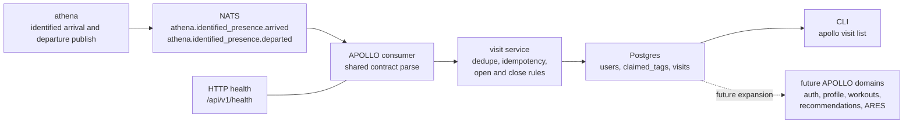

# apollo

APOLLO is the member-facing application in ASHTON. It will eventually own
profile state, privacy and availability controls, workout logging,
recommendations, and the ARES matchmaking subsystem.

> Current real slice: first-party member auth and session-backed profile state,
> deterministic visit-history ingest and close behavior, and derived lobby
> eligibility from persisted `visibility_mode` / `availability_mode`. APOLLO
> now proves account ownership, signed session handling, the first full visit
> lifecycle slice, and the first real intent-behavior slice without widening
> into workouts, matchmaking, or recommendations.

This repo is now executable, but still intentionally narrow. The right way to
document it is to separate what is already real from what is only authored in
schema form or preserved as a future plan. Tracer 5 completes the first visit
lifecycle slice: physical departure can close visit history without inventing
workout semantics or social intent.

## Architecture

The standalone Mermaid source for this flow lives at
[`docs/diagrams/apollo-visit-ingest.mmd`](docs/diagrams/apollo-visit-ingest.mmd).

## Runtime Surfaces

| Surface | Path / Command | Status | Notes |
| --- | --- | --- | --- |
| HTTP health | `GET /api/v1/health` | Real | Indicates service health and whether the NATS consumer is enabled |
| Serve command | `apollo serve` | Real | Starts the health endpoint and optional NATS consumer |
| Verification start | `POST /api/v1/auth/verification/start` | Real | Starts registration or passwordless sign-in with student ID + email |
| Verification consume | `GET/POST /api/v1/auth/verify` | Real | Consumes a stored token, marks it used, verifies email ownership, and issues a signed session cookie |
| Profile read | `GET /api/v1/profile` | Real | Requires a valid session cookie and returns persisted member profile state |
| Profile update | `PATCH /api/v1/profile` | Real | Requires a valid session cookie and updates `visibility_mode` and `availability_mode` only |
| Lobby eligibility read | `GET /api/v1/lobby/eligibility` | Real | Requires a valid session cookie and derives open-lobby eligibility from stored profile state only |
| Logout | `POST /api/v1/auth/logout` | Real | Revokes the current server-side session and clears the cookie |
| Visit readback | `apollo visit list --student-id ... --format text|json` | Real | Lists visit history for a member |
| Event consumer | `apollo serve` with `APOLLO_NATS_URL` | Real | Consumes `athena.identified_presence.arrived` and `athena.identified_presence.departed` from NATS |
| Workout logging runtime | - | Planned | Tables exist, runtime does not |
| Recommendation runtime | - | Planned | Schema exists, pipeline does not |
| Matchmaking runtime | - | Planned | ARES tables exist, service logic does not |

## Ownership And Boundaries

| APOLLO Owns | APOLLO Does Not Own |
| --- | --- |
| member profile and preference state | raw facility presence truth |
| derived lobby eligibility from explicit member intent | open lobby membership, invites, or match formation |
| visit history as member-facing context | occupancy counting |
| workout history | staff operations workflows |
| recommendation and coaching context | the shared wire contract definitions |
| explicit matchmaking intent and ARES | tool routing and global approval policy |

APOLLO owns member intent. That is the key boundary. Presence can affect member
context, but tap-in alone must not create workout logs, matchmaking lobby
eligibility, or any social state.

## Current Data Model

| Area | Status | Current Runtime Use |
| --- | --- | --- |
| `apollo.users` | Real | Member records now support visit linkage, email verification state, and flexible profile preferences |
| `apollo.email_verification_tokens` | Real | Stores hashed verification tokens with expiry and single-use semantics |
| `apollo.sessions` | Real | Stores server-side session state keyed by a signed cookie value |
| `apollo.claimed_tags` | Real | Links ATHENA identity hashes to member accounts |
| `apollo.visits` | Real | Stores visit open/close history with deterministic departure idempotency |
| `apollo.workouts` and `apollo.exercises` | Schema authored | Runtime deferred until workout logging tracer work starts |
| `apollo.ares_*` tables | Schema authored | Matchmaking and skill logic are deferred |
| `apollo.recommendations` | Schema authored | Recommendation runtime is deferred |
| `users.preferences` JSONB | Real schema, future-heavy use | Intended home for flexible member-intent state such as `visibility_mode` and `availability_mode` |

## Technology Stack

| Layer | Technology | Status | Notes |
| --- | --- | --- | --- |
| Service runtime | Go 1.23 | Instituted | The current executable slice is a Go service |
| HTTP router | chi | Instituted | Current API surface is intentionally tiny |
| CLI | Cobra | Instituted | `serve` and `visit list` are real |
| Database driver | pgx | Instituted | Used for runtime persistence |
| SQL generation | sqlc | Instituted | Auth, session, profile, and visit queries are generated from checked-in SQL |
| Eventing | NATS | Instituted | Consumes ATHENA identified arrival and departure events |
| Shared contract | `ashton-proto` generated packages + runtime helper | Instituted | APOLLO no longer owns a private copy of the event wire format |
| Auth path | first-party student ID + email verification + signed session cookie | Real | Tokens are stored hashed in Postgres and sessions are server-side rows referenced by a signed cookie |
| Workout runtime | relational workout model | Planned | Tables exist; runtime does not |
| Recommendation pipeline | LangGraph + vLLM + Mem0 | Deferred | Preserved as future direction, not current runtime truth |
| ARES rating engine | OpenSkill | Deferred | Schema groundwork exists, service layer does not |
| Frontend | SvelteKit PWA | Deferred | Not yet present in the repo |

## Current Ingest Path

| Step | Current Behavior |
| --- | --- |
| ATHENA publishes lifecycle events | Subjects are `athena.identified_presence.arrived` and `athena.identified_presence.departed` |
| APOLLO inspects for the narrow anonymous no-op | Anonymous misroutes are ignored before strict parsing |
| APOLLO parses the payload | The shared `ashton-proto` helper validates source, type, enums, and timestamps |
| APOLLO resolves member identity | `claimed_tags` maps the ATHENA identity hash to an active user |
| APOLLO enforces idempotency | Duplicate arrival ids, duplicate departure ids, and already-open visits resolve deterministically |
| APOLLO records the lifecycle | Arrivals open visits, departures close matching open visits for the same member and facility |

This flow is intentionally narrower than the future product shape. It proves the
boundary from physical truth to member history first, before auth, workouts,
recommendations, or matchmaking are allowed to widen the repo.

## Current State Block

### Already real in this repo

- `apollo serve` starts a real Go process with health reporting
- APOLLO can start a member verification flow from student ID + email
- verification tokens are generated, stored hashed, expired, invalidated after use, and can be surfaced in local development through explicit token logging
- successful verification marks the user email as verified and issues a signed `HTTPOnly`, `Secure`, `SameSite=Strict` session cookie
- authenticated profile reads and writes are real for `visibility_mode` and `availability_mode`
- authenticated `GET /api/v1/lobby/eligibility` is real and derives
  `eligible`, `reason`, `visibility_mode`, and `availability_mode` from stored
  member state only
- logout revokes the current server-side session and clears the cookie
- APOLLO can consume `athena.identified_presence.arrived` and
  `athena.identified_presence.departed` from NATS
- the consumer uses the shared `ashton-proto` helper instead of a private event
  struct
- malformed payloads, wrong source values, wrong types, bad enums, and invalid
  timestamps are rejected clearly
- duplicate arrivals, duplicate departures, unknown tags, anonymous events,
  already-open visits, no-open departures, and out-of-order departures all
  resolve deterministically
- `apollo visit list` reads back recorded visit history for a specific student

### Real but intentionally narrow

- the active member-facing write surface is still limited to auth and profile
  settings
- open-lobby eligibility is derived read-only state, not a join or leave flow
- visit recording and visit closing remain separate from auth and profile state
- workouts, recommendations, and matchmaking are still outside the active
  tracer scope

### Authored in schema, not yet active in runtime

- workout and exercise tables
- ARES rating and match tables
- recommendation storage

### Deferred on purpose

- tying visit creation or visit closing to workout logging
- letting tap-in imply lobby or matchmaking intent
- adding lobby membership persistence, invites, or match formation before the
  eligibility boundary is proven
- adding a frontend before the profile/auth boundary is real
- adding the recommendation pipeline before workout data exists

## Project Structure

| Path | Purpose |
| --- | --- |
| `cmd/apollo/` | CLI entrypoint and serve command |
| `internal/auth/` | verification token lifecycle, server-side sessions, and signed cookie handling |
| `internal/eligibility/` | derived open-lobby eligibility from authenticated member state |
| `internal/consumer/` | NATS consumer and strict event parsing |
| `internal/profile/` | authenticated profile state read and update over `users.preferences` |
| `internal/visits/` | visit service and repository boundary |
| `internal/store/` | sqlc-generated models and query bindings |
| `internal/server/` | health, auth, profile, and session middleware wiring |
| `db/migrations/` | current schema for users, auth/session state, visits, workouts, ARES, and recommendations |
| `db/queries/` | checked-in SQL for auth, profile, and visit operations |
| `docs/` | roadmap, ADRs, runbook, growing pains, and diagrams |

## Deployment Boundary

APOLLO owns its runtime, schema, and consumer logic. Infrastructure, GitOps,
and cluster policy still live outside this repo in the Prometheus/Talos layer.
This README is documenting APOLLO's internal system logic and product boundary,
not the homelab substrate.

## Docs Map

- [APOLLO diagram](docs/diagrams/apollo-visit-ingest.mmd)
- [Roadmap](docs/roadmap.md)
- [Growing pains](docs/growing-pains.md)
- [Member state runbook](docs/runbooks/member-state.md)
- [ADR 001: member state model](docs/adr/001-member-state-model.md)
- [ADR 002: member auth](docs/adr/002-member-auth.md)
- [ADR index](docs/adr/README.md)

## Why APOLLO Matters

APOLLO is where the platform starts to look like a product instead of only an
operations system. Even in its current narrow form, it already shows contract
discipline, first-party auth taste, deterministic failure handling, relational
schema design, event-driven ingestion, and a strong boundary between presence,
profile state, workouts, and matchmaking intent. The current tracer proves the
first full visit lifecycle slice: physical departure closes visit history
without inventing workout semantics or social intent.
