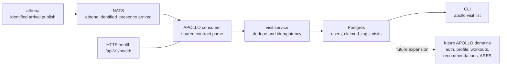

# apollo

APOLLO is the member-facing application in ASHTON. It will eventually own
profile state, privacy and availability controls, workout logging,
recommendations, and the ARES matchmaking subsystem.

> Current real slice: consume `athena.identified_presence.arrived`, validate it
> through the shared `ashton-proto` runtime contract, and record deterministic
> visit history in Postgres without collapsing visits into workouts or
> matchmaking intent.

This repo is now executable, but still intentionally narrow. The right way to
document it is to separate what is already real from what is only authored in
schema form or preserved as a future plan.

## Architecture

The standalone Mermaid source for this flow lives at
[`docs/diagrams/apollo-visit-ingest.mmd`](docs/diagrams/apollo-visit-ingest.mmd).

## Runtime Surfaces

| Surface | Path / Command | Status | Notes |
| --- | --- | --- | --- |
| HTTP health | `GET /api/v1/health` | Real | Indicates service health and whether the NATS consumer is enabled |
| Serve command | `apollo serve` | Real | Starts the health endpoint and optional NATS consumer |
| Visit readback | `apollo visit list --student-id ... --format text|json` | Real | Lists visit history for a member |
| Event consumer | `apollo serve` with `APOLLO_NATS_URL` | Real | Consumes `athena.identified_presence.arrived` from NATS |
| Profile endpoints | - | Planned | Belong to Tracer 3 and later |
| Workout logging runtime | - | Planned | Tables exist, runtime does not |
| Recommendation runtime | - | Planned | Schema exists, pipeline does not |
| Matchmaking runtime | - | Planned | ARES tables exist, service logic does not |

## Ownership And Boundaries

| APOLLO Owns | APOLLO Does Not Own |
| --- | --- |
| member profile and preference state | raw facility presence truth |
| visit history as member-facing context | occupancy counting |
| workout history | staff operations workflows |
| recommendation and coaching context | the shared wire contract definitions |
| explicit matchmaking intent and ARES | tool routing and global approval policy |

APOLLO owns member intent. That is the key boundary. Presence can affect member
context, but tap-in alone must not create workout logs, matchmaking lobby
eligibility, or any social state.

## Current Data Model

| Area | Status | Current Runtime Use |
| --- | --- | --- |
| `apollo.users` | Real | Member records exist and are looked up during visit creation |
| `apollo.claimed_tags` | Real | Links ATHENA identity hashes to member accounts |
| `apollo.visits` | Real | Stores arrival-driven visit history |
| `apollo.workouts` and `apollo.exercises` | Schema authored | Runtime deferred until workout logging tracer work starts |
| `apollo.ares_*` tables | Schema authored | Matchmaking and skill logic are deferred |
| `apollo.recommendations` | Schema authored | Recommendation runtime is deferred |
| `users.preferences` JSONB | Real schema, future-heavy use | Intended home for flexible member-intent state such as `visibility_mode` and `availability_mode` |

## Technology Stack

| Layer | Technology | Status | Notes |
| --- | --- | --- | --- |
| Service runtime | Go 1.23 | Instituted | The current executable slice is a Go service |
| HTTP router | chi | Instituted | Current API surface is intentionally tiny |
| CLI | Cobra | Instituted | `serve` and `visit list` are real |
| Database driver | pgx | Instituted | Used for runtime persistence |
| SQL generation | sqlc | Instituted | Visit queries and models are generated from checked-in SQL |
| Eventing | NATS | Instituted | Consumes ATHENA identified-arrival events |
| Shared contract | `ashton-proto` generated packages + runtime helper | Instituted | APOLLO no longer owns a private copy of the event wire format |
| Auth path | student ID + email verification + session cookie | Planned | Locked in ADR, not implemented yet |
| Workout runtime | relational workout model | Planned | Tables exist; runtime does not |
| Recommendation pipeline | LangGraph + vLLM + Mem0 | Deferred | Preserved as future direction, not current runtime truth |
| ARES rating engine | OpenSkill | Deferred | Schema groundwork exists, service layer does not |
| Frontend | SvelteKit PWA | Deferred | Not yet present in the repo |

## Current Ingest Path

| Step | Current Behavior |
| --- | --- |
| ATHENA publishes an event | Subject is `athena.identified_presence.arrived` |
| APOLLO inspects for the narrow anonymous no-op | Anonymous misroutes are ignored before strict parsing |
| APOLLO parses the payload | The shared `ashton-proto` helper validates source, type, enums, and timestamps |
| APOLLO resolves member identity | `claimed_tags` maps the ATHENA identity hash to an active user |
| APOLLO enforces idempotency | Duplicate `source_event_id` and already-open visits resolve deterministically |
| APOLLO records the visit | A visit row is created only when the arrival is valid, identified, and new |

This flow is intentionally narrower than the future product shape. It proves the
boundary from physical truth to member history first, before auth, workouts,
recommendations, or matchmaking are allowed to widen the repo.

## Current State Block

### Already real in this repo

- `apollo serve` starts a real Go process with health reporting
- APOLLO can consume `athena.identified_presence.arrived` from NATS
- the consumer uses the shared `ashton-proto` helper instead of a private event
  struct
- malformed payloads, wrong source values, wrong types, bad enums, and invalid
  timestamps are rejected clearly
- duplicate arrivals, unknown tags, anonymous events, and already-open visits
  all resolve deterministically
- `apollo visit list` reads back recorded visit history for a specific student

### Real but intentionally narrow

- the API surface only exposes health today
- visit recording is the only active member-facing runtime behavior
- auth, workouts, recommendations, and matchmaking are still outside the active
  tracer scope

### Authored in schema, not yet active in runtime

- flexible member state in `users.preferences`
- workout and exercise tables
- ARES rating and match tables
- recommendation storage

### Deferred on purpose

- tying visit creation to workout logging
- letting tap-in imply matchmaking intent
- adding a frontend before the profile/auth boundary is real
- adding the recommendation pipeline before workout data exists

## Project Structure

| Path | Purpose |
| --- | --- |
| `cmd/apollo/` | CLI entrypoint and serve command |
| `internal/consumer/` | NATS consumer and strict event parsing |
| `internal/visits/` | visit service and repository boundary |
| `internal/store/` | sqlc-generated models and query bindings |
| `internal/server/` | health endpoint wiring |
| `db/migrations/` | current schema for users, visits, workouts, ARES, and recommendations |
| `db/queries/` | checked-in SQL for visit operations |
| `docs/` | roadmap, ADRs, runbook, growing pains, and diagrams |

## Deployment Boundary

APOLLO owns its runtime, schema, and consumer logic. Infrastructure, GitOps,
and cluster policy still live outside this repo in the Prometheus/Talos layer.
This README is documenting APOLLO's internal system logic and product boundary,
not the homelab substrate.

## Docs Map

- [APOLLO diagram](docs/diagrams/apollo-visit-ingest.mmd)
- [Roadmap](docs/roadmap.md)
- [Growing pains](docs/growing-pains.md)
- [Member state runbook](docs/runbooks/member-state.md)
- [ADR 001: member state model](docs/adr/001-member-state-model.md)
- [ADR 002: member auth](docs/adr/002-member-auth.md)
- [ADR index](docs/adr/README.md)

## Why APOLLO Matters

APOLLO is where the platform starts to look like a product instead of only an
operations system. Even in its current narrow form, it already shows contract
discipline, event-driven ingestion, deterministic failure handling, relational
schema design, and a strong boundary between presence, workouts, and
matchmaking intent.
